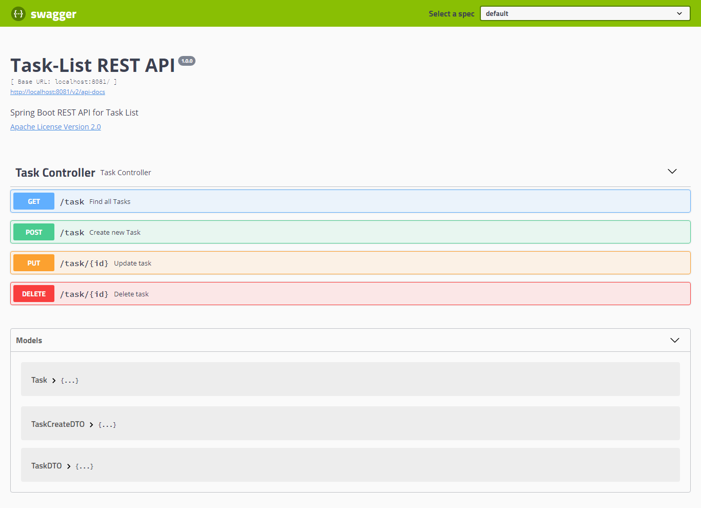

# Cloud Parking


REST API para gerenciamento de tarefas

## Project features

- `features 1`: Obtem todas as tarefas
- `features 3`: Criação de novas tarefas
- `features 4`: Atualização de tarefas
- `features 6`: Deleta tarefapassando o ID




## Getting Started
Para executar o projeto, será necessário instalar os seguintes programas:
<ul>
  <li>JDK 11</li>
  <li>Maven 4</li>
  <li>Um editor dde sua preferência</li>
</ul>

## Development
Para iniciar o desenvolvimento, é necessário clonar o projeto do GitHub num diretório de sua preferência:
```shell
cd "diretorio de sua preferencia"
git clone https://github.com/dgleyramos1/Task-List
```

## Build
Para construir o projeto com o Maven, executar os comando abaixo:

```shell
mvn clean install
```

O comando irá baixar todas as dependências do projeto e criar um diretório *target* com os artefatos construídos, que incluem o arquivo jar do projeto. Além disso, serão executados os testes unitários, e se algum falhar, o Maven exibirá essa informação no console.

## Tests

Para rodar os testes, utilize o comando abaixo:

```shell
mvn test
```

## Routes

Documentação com Swagger
```
/swagger-ui.html
```

GET -> Find All Tasks
```
/task
```
POST -> Create New Task
```
/task
```
PUT -> Update Task
```
/task/{id}
```
DELETE -> Delete Task
```
/task/{id}
```

## Models
### Task
* id: Long
* task: String
* description: String

### TaskCreateDTO
* task: String
* description: String

### TaskDTO
* id: Long
* task: String
* description: String

## Contributions

Contribuições são sempre bem-vindas! Para contribuir lembre-se sempre de adicionar testes unitários para as novas classes com a devida documentação.

## Links
* Documentação: [Doc](https://api-rest-taks-list.herokuapp.com/swagger-ui.html})

## License
* [GNU](LICENSE.md)

## Author
Dgley Ramos
[LinkedIn](https://www.linkedin.com/in/dgleyramos/)


<p><a href="https://www.buymeacoffee.com/dgleyramos"> </a></p><br><br>
